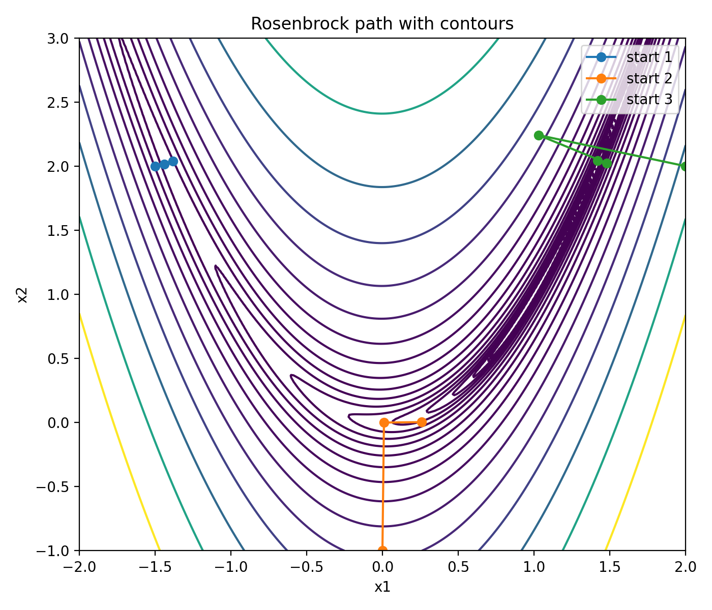
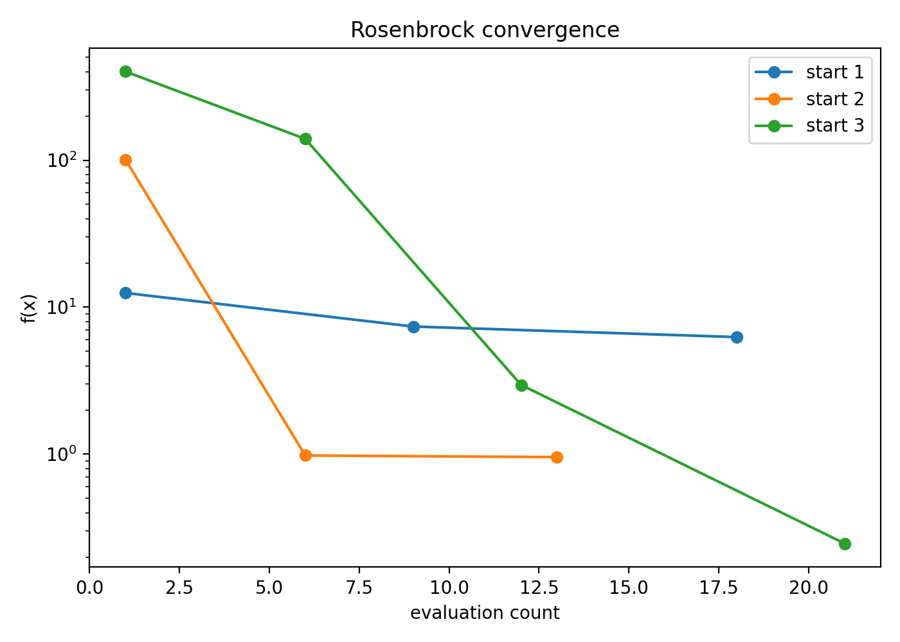
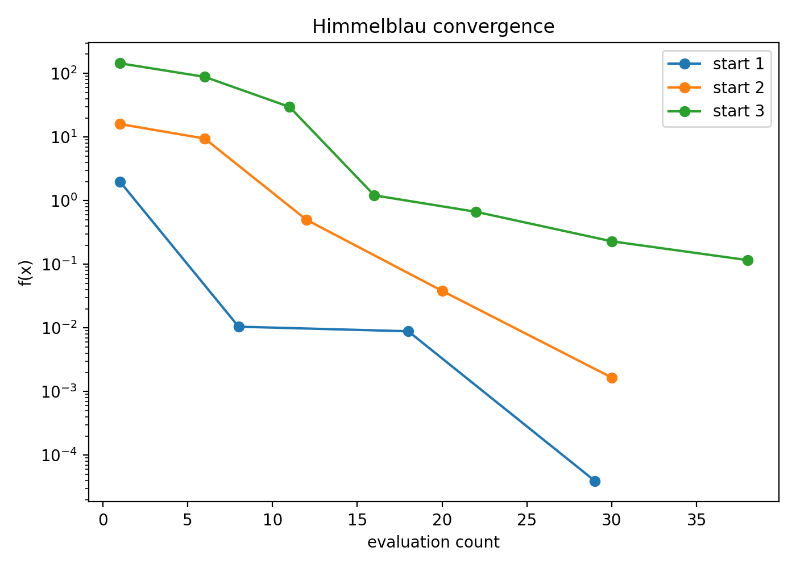
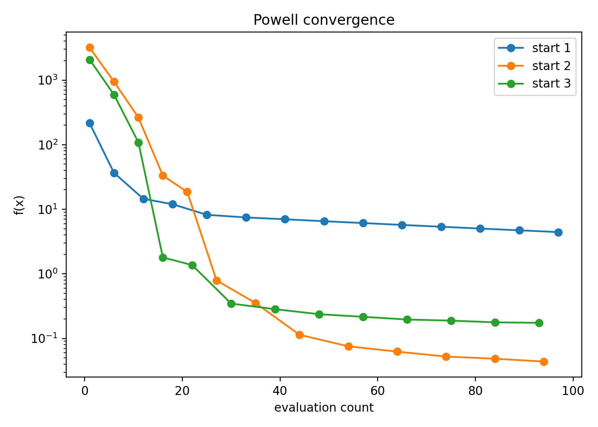

# AA222 Project 1 Writeup

## Method

I used a local descent method with backtracking line search for all three simple problems.

At each iteration, the algorithm:

1. Evaluates the gradient `g(x)`.
2. Forms the descent direction using the normalized negative gradient,
   `d = -g(x) / ||g(x)||`.
3. Uses backtracking line search to find a step size `alpha` satisfying an Armijo-style decrease condition.
4. Updates the iterate with `x <- x + alpha d`.

The implementation is evaluation-budget aware. Since each call to `f` costs one evaluation and each call to `g` costs two evaluations, the optimizer stops when the remaining budget is insufficient to safely take another step.

This method is simple and robust. It performs well on the three provided simple problems, although it is not especially curvature-aware, so Rosenbrock's function remains the most difficult of the three.

## Local Test Results

Using `python3 localtest.py -t all -n 100`, the current implementation performed better than random search at the following rates:

- `simple1`: `75.0%`
- `simple2`: `94.0%`
- `simple3`: `99.0%`

## Rosenbrock Path Plot

The figure below shows the optimization path on Rosenbrock's function from three different starting points, overlaid on objective contours.

## Convergence Plots

The following plots show objective value versus evaluation count for the three simple problems, using three starting points for each.

### Rosenbrock

### Himmelblau

### Powell

## Notes

- The README figures were generated with the helper in `project1_py/project1.py` using `generate_plots(...)`.
- The convergence plots use evaluation count on the x-axis.
- The plot generation code is separate from the grader-facing `optimize(...)` workflow so the autograder path does not spend time writing figures.
